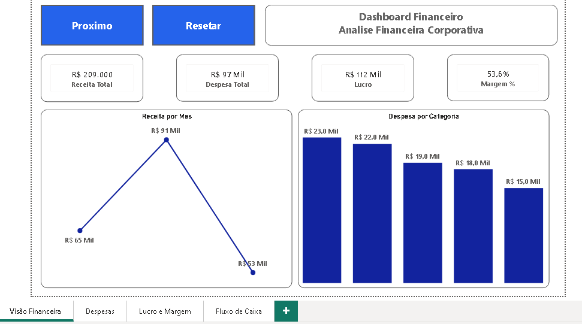
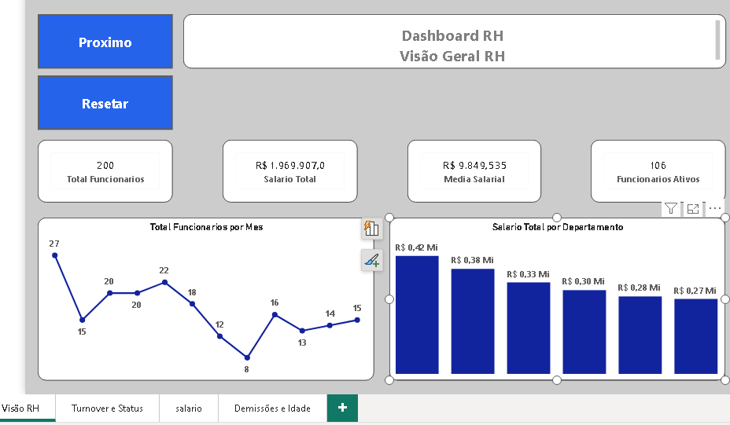
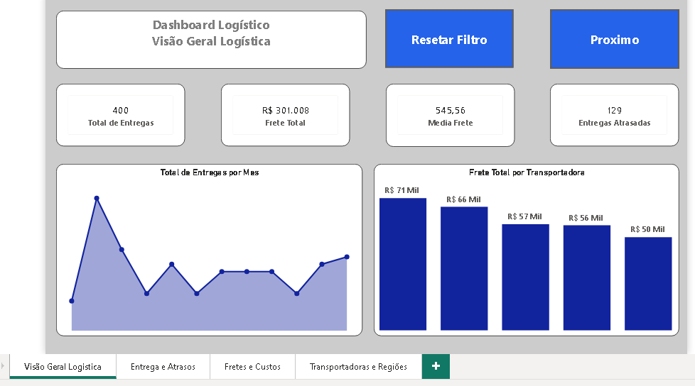

# Portifolio Power BI

Este repositorio reune projetos desenvolvidos em Power BI com foco em analise de dados, indicadores de desempenho (KPIs) e apoio a tomada de decisão.

Projetos

Dashboard de vendas

Analise de faturamento
Crescimento de vendas
Desempenho por região
Indicadores comerciais

Dashboard Financeiro

Receita e despesas
Lucro e margem
Fluxo de caixa
Indicadores financeiros

Dashboard RH
Admissões e desligamentos
Turnover
Indicadores de colaboradores
Analises de recurso Humanos

Dashboard Logistico

Entregas 
Fretes
Atrasos
Eficiencia operacional
Indicadores logisticos

Ferramentas Utilizadas 

Power BI
DAX
Excel
Python (em desenvolvimento)
SQL Server(em desenvolvimento)

Autor Nielson José

## Dashboards

### Dashboard de Vendas

### Dashboard Financeiro

### Dashboard RH

### Dashboard Logístico

